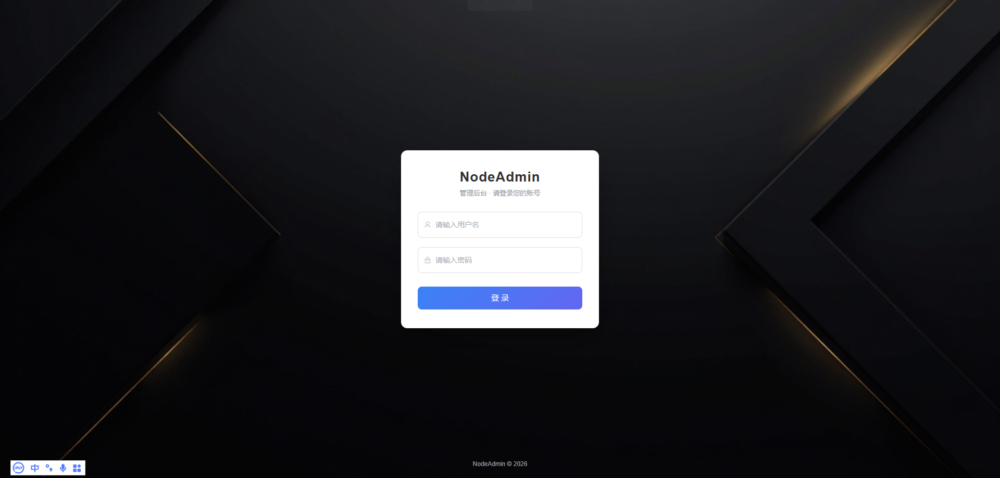
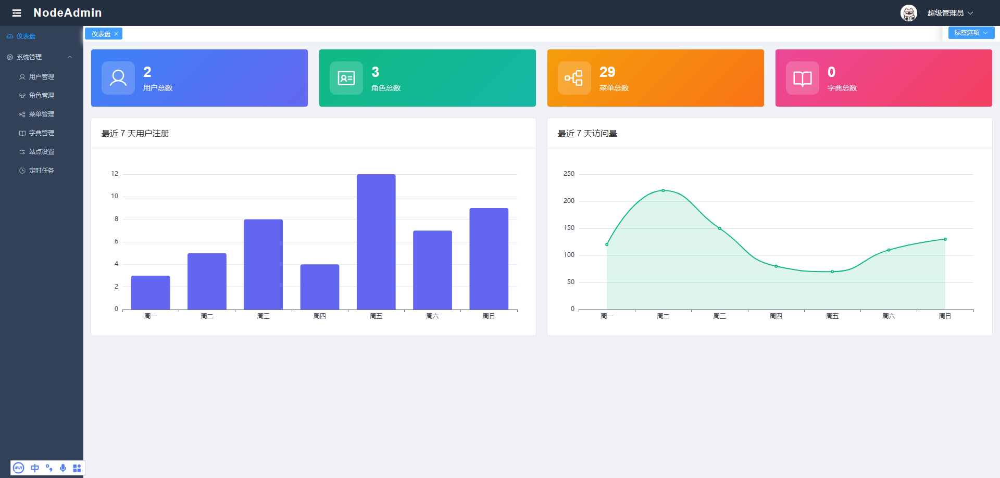
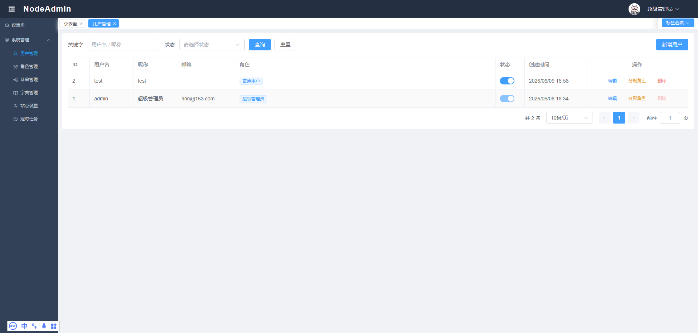
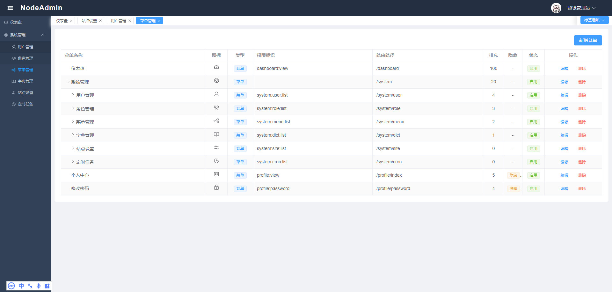
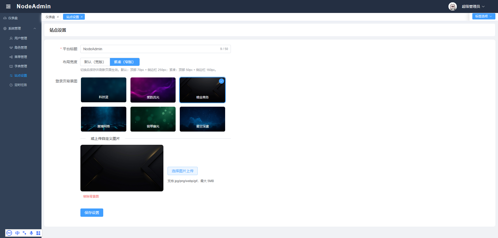
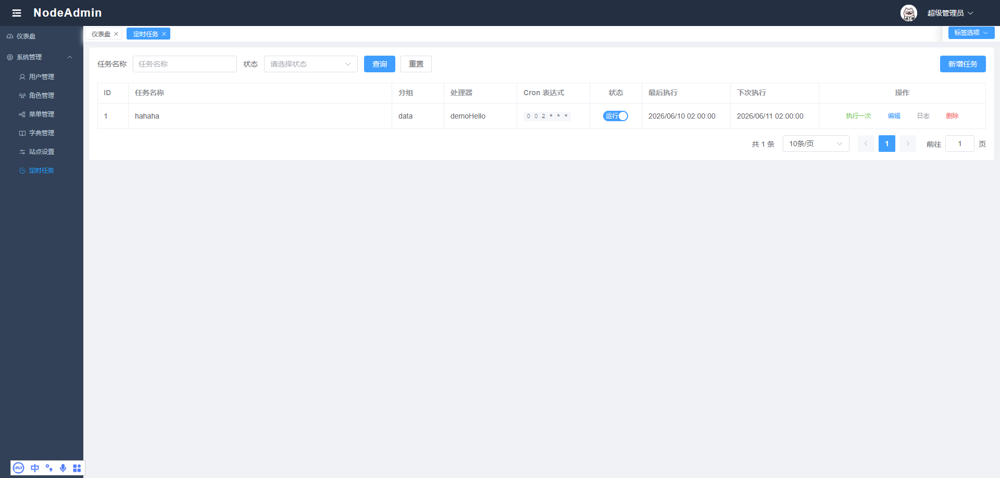

# NodeAdmin

<div align="center">

基于 NestJS + Vue 3 的全栈管理平台起手框架，采用 pnpm Monorepo 架构。


</div>

> **定位**：本项目是一个开箱即用的全栈后台管理起手框架，提供用户管理、角色权限、菜单配置、字典管理、定时任务等通用后台能力。开发者可以在此基础上快速扩展业务模块，专注于业务逻辑而非重复搭建基础框架。
>
> 🤖 **AI 友好**：代码注释充分、模块边界清晰、类型定义完整，**特别适合作为 AI 辅助开发（Cursor / Trae / Copilot / Claude Code 等）的管理平台启动项目**。AI 可以快速理解模块结构，按需生成业务代码，而无需先花时间解读基础框架。

## ✨ 核心特性

- 🎯 **双模式数据库**：开箱即用 SQLite，零配置启动；一行环境变量切换 MySQL
- 🔐 **完整 RBAC 权限**：用户 → 角色 → 菜单/按钮三级管控，后端 `@Permiss` 守卫 + 前端 `v-permiss` 指令
- 🌲 **动态菜单树**：菜单/按钮同一张表，支持任意层级、隐藏节点、排序
- ⏰ **动态定时任务**：可视化配置 Cron 表达式，支持手动触发、执行日志、并发控制
- 📚 **数据字典**：通用 `type/value/label` 模型，前端按需拉取下拉选项
- 🎨 **通用 CRUD 组件**：`<CrudTable />` 配列配搜索项即可生成列表页
- 🛡️ **JWT 双路认证**：HttpOnly Cookie + Authorization Header，兼顾前后端分离与同源场景
- 📦 **pnpm Monorepo**：`api` / `web` / `shared` 三包共享类型，类型一次定义前后端复用
- 🚀 **零配置启动**：没有 `.env` 也能跑起来，目录自动创建、seed 自动初始化
- 🔧 **类型化共享**：`@nodeadmin/shared` 存放前后端共用 TypeScript 类型

## 📷 项目截图

> 启动后端 + 前端后访问 `http://localhost:5173`，使用 `admin` / `admin123` 登录。

|                 登录页                 |                 仪表盘                  |
| :------------------------------------: | :-------------------------------------: |
|   |  |
|              **用户管理**              |              **菜单管理**               |
|  |   |
|              **站点设置**              |              **定时任务**               |
|  |   |

> 💡 截图位于 `docs/screenshots/` 目录。

## 🛠️ 技术栈

| 层级      | 技术                              | 版本  |
| --------- | --------------------------------- | ----- |
| 后端框架  | NestJS                            | 11    |
| ORM       | TypeORM                           | 0.3   |
| 数据库    | SQLite（默认）/ MySQL             | -     |
| 认证      | JWT + Passport（HttpOnly Cookie） | -     |
| 前端框架  | Vue 3 + TypeScript                | 3.5   |
| UI 组件库 | Element Plus                      | 2.9   |
| 构建工具  | Vite                              | 6     |
| 状态管理  | Pinia                             | 3     |
| 包管理    | pnpm Workspace                    | 10.28 |

### 项目结构

```
NodeAdmin/
├── packages/
│   ├── nodeadmin-api/       # 后端 API 服务（NestJS）
│   ├── nodeadmin-web/       # 前端 Web 应用（Vue 3 + Vite）
│   └── nodeadmin-shared/    # 前后端共享类型定义
├── pnpm-workspace.yaml
└── package.json
```

### 后端模块

| 模块      | 路径                 | 说明                                 |
| --------- | -------------------- | ------------------------------------ |
| auth      | `modules/auth/`      | 登录、登出、修改密码、当前用户       |
| user      | `modules/user/`      | 用户管理 CRUD + 分配角色             |
| role      | `modules/role/`      | 角色管理 CRUD + 分配菜单             |
| menu      | `modules/menu/`      | 菜单 / 按钮权限 CRUD（树形）         |
| dict      | `modules/dict/`      | 字典管理 CRUD                        |
| site      | `modules/site/`      | 站点设置（标题、登录背景、布局）     |
| cron      | `modules/cron/`      | 定时任务管理 + 执行日志              |
| dashboard | `modules/dashboard/` | 仪表盘统计                           |
| file      | `modules/file/`      | 文件上传                             |
| seed      | `modules/seed/`      | 启动种子数据（超管账号、角色、菜单） |

### 数据库

- **默认**：SQLite（零配置，数据文件 `./data/nodeadmin.db`）
- **可选**：MySQL（通过环境变量 `DB_TYPE=mysql` 切换）
- TypeORM `synchronize: true` 自动同步表结构，无需手动建表
- 首次启动会自动创建数据库文件目录（SQLite）和上传目录

**手动建表（生产环境备用）**

项目提供了两份 SQL 初始化脚本，位于 `packages/nodeadmin-api/scripts/`：

| 文件              | 适用数据库                   |
| ----------------- | ---------------------------- |
| `init-sqlite.sql` | SQLite                       |
| `init-mysql.sql`  | MySQL 5.7+ / 8.0+（utf8mb4） |

使用方式：

```bash
# SQLite（通过 sqlite3 命令行工具）
sqlite3 ./data/nodeadmin.db < scripts/init-sqlite.sql

# MySQL
mysql -u root -p nodeadmin < scripts/init-mysql.sql
```

> **说明**：`synchronize: true` 在开发/生产环境均启用。新增字段会自动同步且不会丢数据；仅当从 Entity 中删除字段时，对应的列才会被移除。如果希望完全控制表结构变更，可在 `.env` 中设置 `NODE_ENV=production` 关闭 SQL 日志，并使用上述脚本手动管理。

### 权限体系

- RBAC 三级：用户 → 角色 → 菜单/按钮
- 全局 JWT 认证守卫，通过 `@Public()` 豁免
- 按钮级权限守卫，通过 `@Permiss('xxx:xxx:xxx')` 控制
- 前端通过 `v-permiss` 指令控制按钮显示

## 🚀 快速开始

### 环境要求

- Node.js >= 18
- pnpm >= 8

### 安装依赖

```bash
cd NodeAdmin
pnpm install
```

### 启动开发服务

```bash
# 同时启动后端和前端（推荐）
pnpm dev:api    # 后端 API → http://localhost:3000/api
pnpm dev:web    # 前端页面 → http://localhost:5173
```

首次启动时，seed 模块会自动创建：

- 超管账号：`admin` / `admin123`
- 3 个内置角色：超级管理员、管理员、普通用户
- 完整菜单和按钮权限

> 🔑 **默认登录账号**：`admin`　**密码**：`admin123`（生产环境请务必修改）

### 环境变量

后端支持以下环境变量（均设有默认值，非必须配置）：

| 变量             | 默认值                                        | 说明                                 |
| ---------------- | --------------------------------------------- | ------------------------------------ |
| `DB_TYPE`        | `sqlite`                                      | 数据库类型：`sqlite` 或 `mysql`      |
| `DB_PATH`        | `./data/nodeadmin.db`                         | SQLite 数据库文件路径                |
| `DB_SYNCHRONIZE` | `true`                                        | 是否自动同步表结构                   |
| `PORT`           | `3000`                                        | API 服务端口                         |
| `CORS_ORIGIN`    | `http://localhost:5173,http://localhost:5174` | CORS 白名单                          |
| `UPLOAD_DIR`     | `./uploads`                                   | 文件上传目录                         |
| `BODY_LIMIT`     | `10mb`                                        | 请求体大小限制                       |
| `JWT_SECRET`     | 内置默认密钥                                  | JWT 签名密钥（**生产环境务必配置**） |

MySQL 模式需额外配置：

| 变量          | 说明       |
| ------------- | ---------- |
| `DB_HOST`     | 数据库主机 |
| `DB_PORT`     | 数据库端口 |
| `DB_USERNAME` | 用户名     |
| `DB_PASSWORD` | 密码       |
| `DB_DATABASE` | 数据库名   |

### 构建生产版本

```bash
pnpm build
```

## 📦 部署

### 后端（Node.js）

```bash
# 构建
cd packages/nodeadmin-api
pnpm build

# 启动（生产环境）
NODE_ENV=production node dist/main.js
```

建议使用 **PM2** 守护进程：

```bash
npm install -g pm2
pm2 start dist/main.js --name nodeadmin-api
pm2 save
pm2 startup
```

### 前端（Nginx）

```bash
cd packages/nodeadmin-web
pnpm build   # 产物在 dist/
```

Nginx 配置示例：

```nginx
server {
  listen 80;
  server_name your-domain.com;

  # 前端静态资源
  location / {
    root /var/www/nodeadmin-web/dist;
    try_files $uri $uri/ /index.html;
  }

  # 后端 API 反代
  location /api/ {
    proxy_pass http://127.0.0.1:3000;
    proxy_set_header Host $host;
    proxy_set_header X-Real-IP $remote_addr;
    proxy_set_header X-Forwarded-For $proxy_add_x_forwarded_for;
    proxy_set_header X-Forwarded-Proto $scheme;
  }

  # 上传文件直连（可选，也可反代）
  location /uploads/ {
    alias /var/www/nodeadmin-uploads/;
  }
}
```

### Docker（参考）

> 完整的 Dockerfile / docker-compose 示例可参考 [zstarbox](https://github.com/) 项目的 `Dockerfile` 和 `docker-compose.yml`，结构与本项目一致（api / web / nginx）。

## 📖 开发指南

### 新增后端模块

1. 在 `packages/nodeadmin-api/src/entities/` 创建实体
2. 在 `packages/nodeadmin-api/src/modules/` 创建模块目录
3. 编写 `xxx.module.ts`、`xxx.controller.ts`、`xxx.service.ts`
4. 在 `app.module.ts` 的 `imports` 中注册模块
5. 在 `seed.service.ts` 中添加菜单和权限的增量 seed

### 新增前端页面

1. 在 `packages/nodeadmin-shared/src/types/` 定义共享类型
2. 在 `packages/nodeadmin-web/src/api/` 创建 API 接口文件
3. 在 `packages/nodeadmin-web/src/views/` 创建页面组件
4. 后端菜单管理中配置路由（component 字段对应 views 下的路径）

### 定时任务开发

定时任务模块采用 **处理器注册表** 模式，新增任务类型只需两步：

**1. 注册处理器**

在 `cron.handler.ts` 的构造函数中注册：

```typescript
constructor() {
  // 注册内置处理器
  this.register('demoHello', this.demoHello.bind(this), '示例任务')
  // 新增处理器 ↓
  this.register('myTask', this.myTask.bind(this), '我的自定义任务')
}

/** 自定义任务处理器 */
private async myTask(params?: Record<string, unknown>): Promise<string> {
  // 业务逻辑...
  return '执行结果描述'
}
```

**2. 管理平台配置**

在管理后台「系统管理 → 定时任务」中新建任务：

- 选择处理器：`myTask`
- 配置 Cron 表达式：如 `0 */5 * * * *`（每 5 分钟）
- 设置任务参数（JSON 格式，可选）

**核心文件说明**

| 文件                 | 职责                                              |
| -------------------- | ------------------------------------------------- |
| `cron.handler.ts`    | 处理器注册表，所有任务执行函数在此注册            |
| `cron.scheduler.ts`  | 调度引擎，服务启动时加载数据库中的任务并注册 cron |
| `cron.service.ts`    | 业务逻辑 CRUD，与调度引擎交互                     |
| `cron.controller.ts` | API 接口，权限码 `system:cron:*`                  |

**注意事项**

- Cron 表达式为 **6 位秒级**格式（秒 分 时 日 月 周），如 `0 0 2 * * *` 表示每天凌晨 2 点
- 默认不允许并发执行（`concurrent=0`），同一任务上一次未完成不会重复触发
- 服务重启后，所有启用状态的任务会自动重新加载到调度引擎
- 手动触发（「执行一次」按钮）不受启用/暂停状态限制

### 数据字典

字典用于维护可枚举的业务取值（如用户状态、订单类型等），同一 `type` 下含多条 `label/value` 选项。

**使用方式**

1. 在「系统管理 → 字典管理」中创建字典项
2. 前端通过 API 获取字典列表：

```typescript
import { getDictByType } from '@/api/dict'

// 获取 user_status 类型的所有字典项
const res = await getDictByType('user_status')
const options = res.data.data // [{ label: '启用', value: '1' }, ...]
```

**约定**

- `type` 字段为分组标识，如 `user_status`、`order_type`
- `value` 为字符串存储，前端按需转换
- 只返回 `status=1` 的启用项，按 `sort DESC` 排序

### 前端公共组件

| 组件           | 路径                            | 说明                                         |
| -------------- | ------------------------------- | -------------------------------------------- |
| CrudTable      | `components/CrudTable.vue`      | 通用 CRUD 表格，配置列和搜索项即可生成列表页 |
| PageHeader     | `components/PageHeader.vue`     | 页面标题栏                                   |
| IconPicker     | `components/IconPicker.vue`     | 图标选择器（Iconify 离线集合）               |
| MenuTreeSelect | `components/MenuTreeSelect.vue` | 菜单树形选择器                               |

**CrudTable 使用示例**

```vue
<CrudTable
  ref="crudRef"
  :columns="columns"
  :api="{ list: getDictList }"
  :search-items="searchItems"
  show-add-button
  add-button-text="新增"
  @add="openDialog"
>
  <template #column-status="{ row }">
    <el-tag :type="row.status === 1 ? 'success' : 'danger'">
      {{ row.status === 1 ? '启用' : '禁用' }}
    </el-tag>
  </template>
  <template #actions="{ row }">
    <el-button @click="handleEdit(row)">编辑</el-button>
    <el-button @click="handleDelete(row)">删除</el-button>
  </template>
</CrudTable>
```

### 共享类型

`packages/nodeadmin-shared` 存放前后端共用的 TypeScript 类型：

- 前后端通过 `import { Xxx } from '@nodeadmin/shared'` 引用
- 修改后需执行 `pnpm --filter @nodeadmin/shared build` 重新构建
- 新增类型文件后需在 `shared/src/index.ts` 中添加导出

## 🤝 贡献

欢迎提交 Issue 和 PR！提交前请确保：

1. 代码通过 `pnpm lint` 检查
2. 新增功能附带必要注释
3. 涉及数据库变更请同步更新 `init-sqlite.sql` 和 `init-mysql.sql`

## 📄 License

[MIT](LICENSE) © NodeAdmin

## 致谢

感谢以下开源项目提供的灵感和参考：

- [vue-manage-system](https://github.com/lin-xin/vue-manage-system) — 基于 Vue 的后台管理系统解决方案
